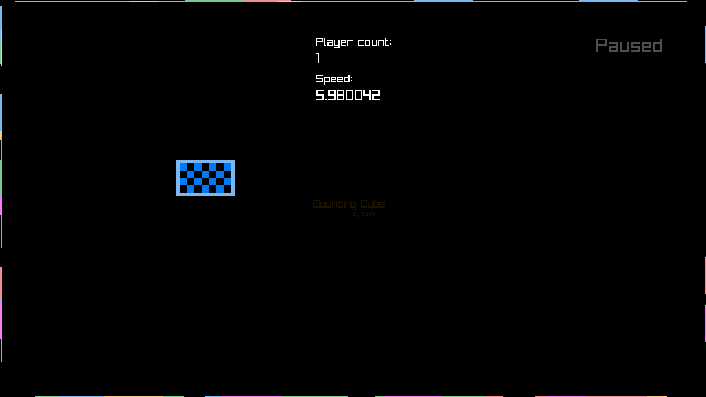
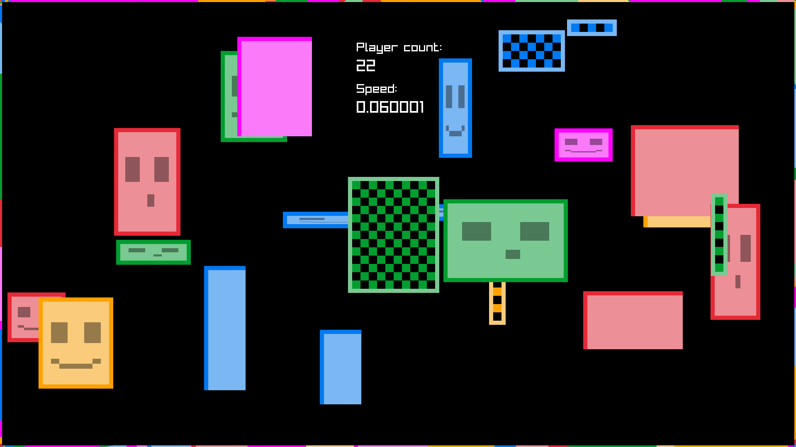
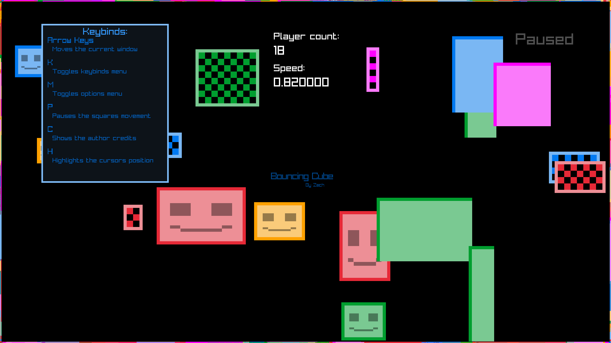
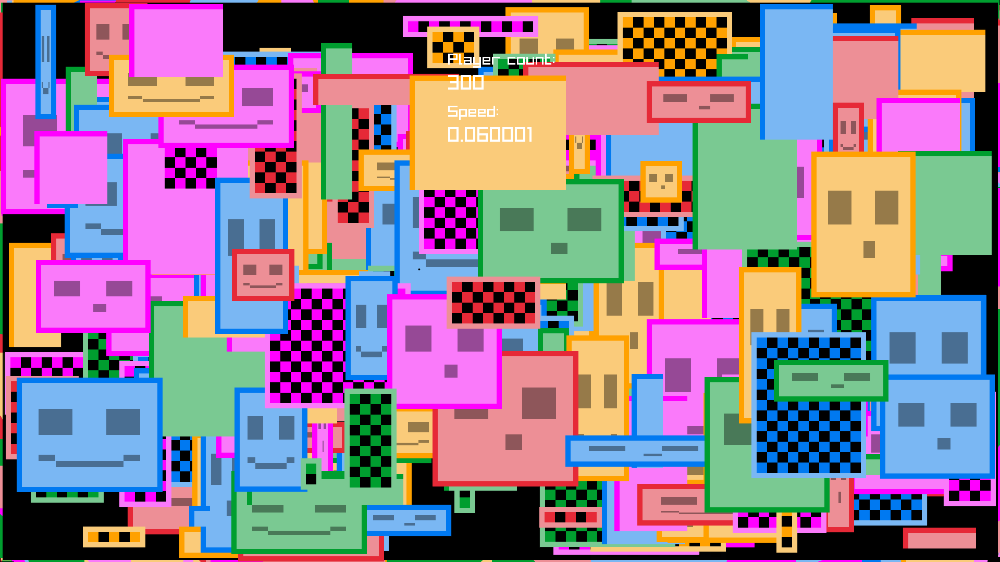
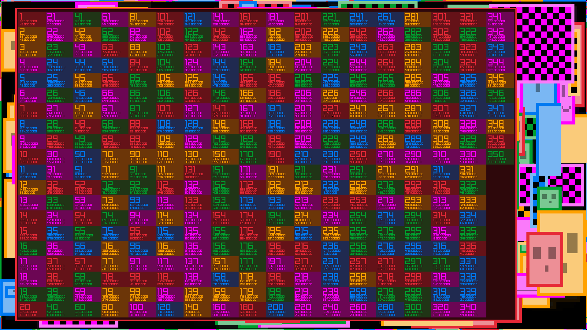

# waiting-screen
This is my waiting screen project used for waiting screens. An example if using this project to keep members of a club or group engaged before a meeting starts, maybe you feel the ice hasn't been broken and this may help that before a meeting. Please feel free to use this project as long as you follow the LICENSE.md, if you have any questions regarding this, please feel free to contact me.

 # Sample photos:

 ### Sample photo: 1
 

 ### Sample photo: 2
 

 ### Sample photo: 3
 

 ### Sample photo: 4
 

 ### Sample photo: 5
 

## Project structure:

## resources
- This directory holds the photos for the README.md file

## lib
- This directory holds all the library files that the program may be using.
- Example: "libraylib.a"

## headerFiles
- This directory holds all the header files that the program may be using.
- Example: "raylib.h" or "player.h"

## cppFiles
- This directory holds all the header files that the program may be using.
- Example: "player.cpp"

## About this project:
 This is a personal project that I developed to practice using a C graphics library called raylib. This project is intended for waiting screens where people can watch either random cubes or their own bounce around like the dvd logo everyone gets drawn to watching. You are able to control a few things at the moment, for example you can press P and the cubes will stop moving completely. You are also able to press and hold the up and down arrow keys to speed up or slow down or even go in reverse time! You can add as many users as you would like by pressing the A key or by pressing F to add 50 at once! Currently there is not a way to add custom users as of now, but there will be very soon! If you are wanting to see a list of the current users that are spawned in, then you can hit the key L to show a list of them shown in sample photo 4.